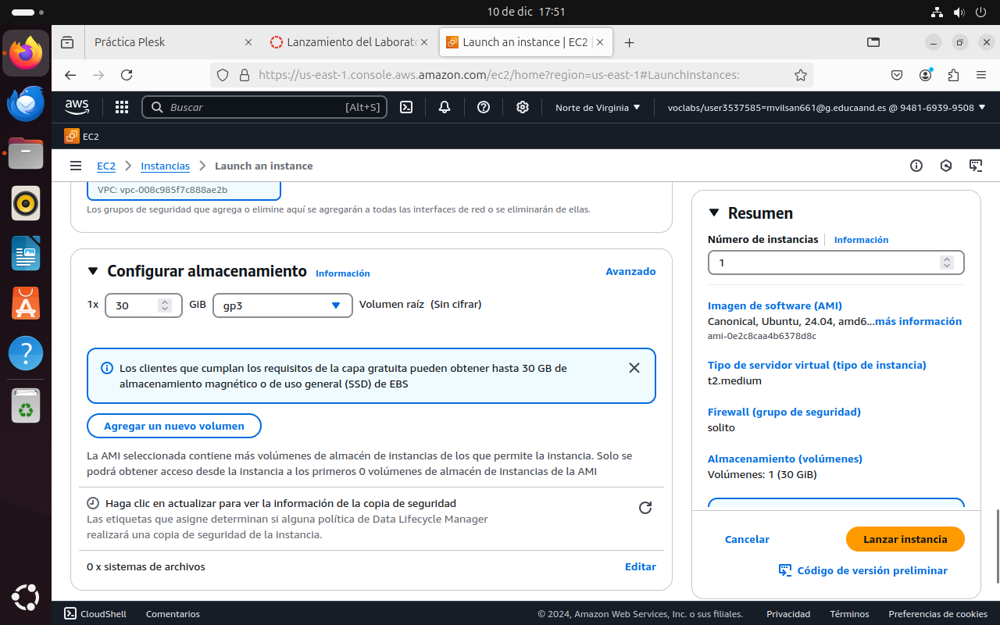
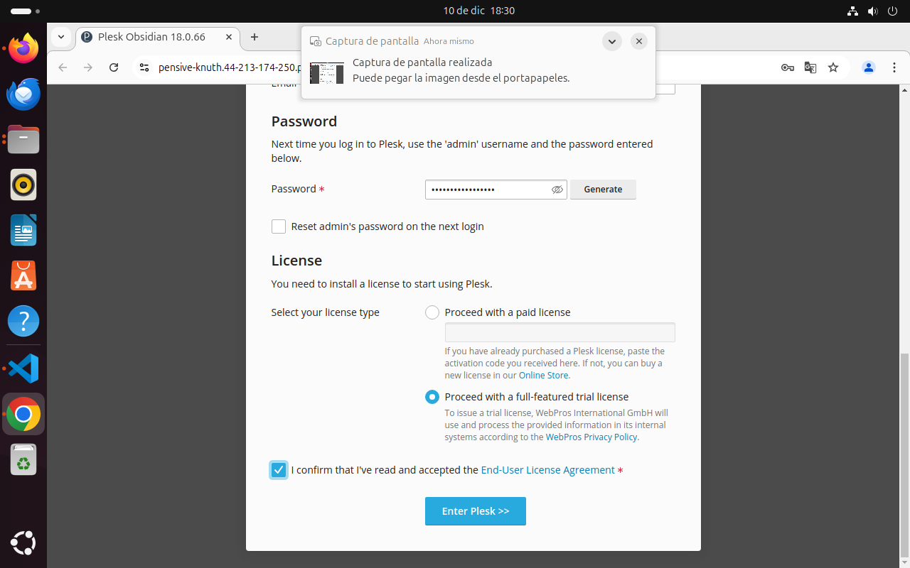
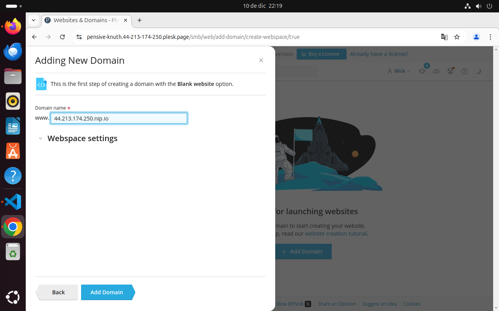
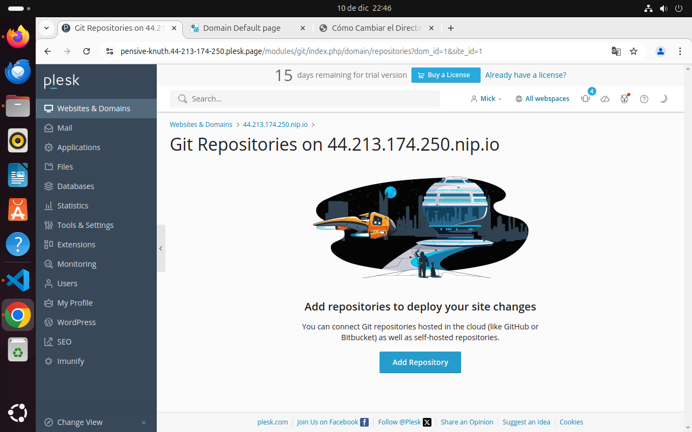

# practicaConPlesk

En esta practica instalaremos plesk, para ello necesitaremos crear una nueva instancia en amazon web service, a esta instancia le crearemos una ip elastica y necesitaremos crear un grupo de seguridad
Los grupos de seguridad es un firewall virtual para las instancias que controla el trafico de entrada y salida

Nos dirigiremos a ec2 > grupos de seguridad > crear grupos de seguridad, le daremos un nombre a nuestro grupo y el vpc será el que se encuentra en pantalla
Agregaremos varias reglas pulando en el boton agregar regla, a continuacion agregaremos reglas con los tipos ssh, http, https, todos los icmp ipv4, tcp personalizado, smtp, smtps, imap, imaps, pop3, pop3s. Cullo destino sedra an
Sigue las imagenes para ver cómo deveria verse


Igualmente haremos lo mismo con las de entrada


Despues de eso crearemos nuestra instancia, pero en la seccion de configuracion de red seleccionaremos la opcion seleccionar grupo de seguridad y seleccionaremos el grupo que acabamos de crear, tambien seleccionaremos en el tipo de servidor la opcion t2 medium


por ultimo en la configuracion ded almacenamiento debemos poner que tenga 30gb de almacenamiento gp3




edn nuestra carpedta scripts el archivo install_plesk.sh

En el escribiremos los comandos 
```
#!/bin/bash
set -ex
```
Necesitaremos actualuizar los paquetes con
```
apt update
apt upgrade -y
```

antes de instalar plesk borraremos el plesk installer si anteriormente ya estaba instalado
```
rm -rf /tmp/plesk-installer
```
Cuando lo hayamos hecho, instalaremos el instalador de plesk en la carpeta tmp
```
wget https://autoinstall.plesk.com/plesk-installer -P /tmp
```
Y por ultimo le daremos permisos con
```
chmod +x /tmp/plesk-installer
```
ejecutamos el script

Una vez lo hayamos ejecutado, instalamos plesk
```
/tmp/plesk-installer install plesk
```
Y ejecutamos nuevamente


Cuando termine la ejecucion, si nos fijamos en la terminal nos habrá dejado una url a plesk, presionamos control y pinchamos en la url y nos llevará a un formulario para registrarnos




Es posible que nos olvidemos de nuestra contrasedña y usuario plesk, si eso sucede podemos poner el siguiente comando para iniciar sesion sin el uso de poner nuestra contrasedña y usduario en plesk: 
```
suddo plesk login
```

Una vez en plesk a primeras veremos que no tenemos dominios creados. Para crear un sitio web, por ejemplo con el uso de un archivo en blanco, desde websites y dominios sle daremos al boton azul add domain, entonces se nos abrirá una pestaña donde podemos seledcionar varias formas de crear un lugar web, podemos subir archivos directamente, hacer un deploy usando git, hacer workpress, estre otras. 
Para hacer una pagina en blanco seleccionamos la primera opcion, blank website.
Despues de lo anterior, nos pedirá que pongamos un nombre de dominio, entonces colocaremos nuestra ip.nip.io




Podemos hacer que los usuarios sea redirigidos sin la www al buscar nuestra página web, para ello nos iremos a websiteds y dominios > hosting y DNS y pinchamos a hosting y se nos abrirá una pestaña de configuracion de hoosting dode en preferencias de dominio ponddremos nuestra ip.nip.io sin www y le damos a guardar

Ahora en file nos encontraremos un directorio de carpetas y un index.html, si le damos a editar se nos abrirá un lateral con codigo html ya escrito (hecho por defecto), podemos cambiar su contenido escribiendo en el. 


Tambien podemos borrar ese index y subir uno nuestro de un proyecto propio, para ello le damos al simbolo + y seleccionamos subir archivo, entonces se subirá el archivo, pero tendremos que renombrarlo por index.html, si no lo hacemos al buscar web.nuestra ip.nip.io en nuestro navegador tendremos un error puesto que no está encontrando el index

### Importante
A pertir de aquí empecé a tener un problema, como quise a volver hacer la practica desde cero hed tenido problemas que tristemente no he podido resolver, a partir de aquí explico los siguiedntes pasos a seguir con muchas menos imagenes. El problema que tengo es el siguiente


## Solicitud de un certificado

Ahora vamos a solicitar un certificado SDSL a lets Encrypt, para ello en websites y dominios ddesplegamos nuestro dominio y le pinchamos a disboard, haremos scroll asta encontrar el apartado de seguridad y pinchamosd en la primera opcion, SSL/TLS Certificate, nos llevara a otro sitio donde haremos scroll asta el final de la pagina y seledccionamos Install a free basic certificate provided by Let's Encrypt, se nos abrira una pestaña donde indicaremos que queramos solicitar un certificado para nuestro dominio., que esd la primera casilla, la saleccionamos y dejaremos el resto de casillas sin seleccionar

## Repositorio git

En plesk podemos añadir subdominios, para ello selleccionaremos en el lateral websites & subdominios > dashboard, veremos unos iconos que podemos seleccionar, vamos ha añadir un subdominio para git que se conectará a nuestro github por medio de una clave ssh. Pulsamos en el icono de git y nos apacerá lo siguiente


Hacemos click en add gitrepositories



Podemos conectarnos a un repositorio remoto, para ello seleccionaremos la opcion remote repository, iremos a un repositorio de github y copiaremos su url por ssh, esta url lo pegaremos en repository url, veremos que se nos generará una clave ssh, esta clave lo necesitamos (recomiendo copiarlo y guardarlo en algun arhivo) 


Este ssh nos ayudará a dar de alta un repositorio, para ello iremos a settings>ssh and gpg keys. Nos encontraremos con un formulario donde pondremos un nombre para la llave y pegaremos la llave que nos ha generado plesk 


Ahora configuramos el valor de document root, que es un directorio donde el servidor servira los archivos de la aplicacion para ello iremos a Websites & Domains > Hosting & DNS > Hosting 
en document root tenemos que poner el nombre de nuestro dominio git que hemos creado plesk, osea git.ip.nip.io/src

Tambien podemos usar las deploy actions para ejecutar comandos en el servidor despues de cada pull para ello en la configuracion del hosting en el que hemos estado antes iremos al al apartado ssh access y en tipo escribiremos /bin/bash

Despues de eso tenemos que configurar qué acciones queremos que se ejecuten después de cada pull en las deploy actions, en Websites & Domains > Dashboard > Git nos iremos a los ajustes del repositorio que hemos creado, se nos abrirá una pestaña desplegable con la configuracion del repositorio, en deployment settingsd den la parte deploy actions escribiremos el comando

```
#!/bin/bash
sed -i "s/database_name_here/lamp_db/" src/config.php
sed -i "s/username_here/lamp_user/" src/config.php
sed -i "s/password_here/Lh8m!f015/" src/config.php
```

guardamos y le hacemos click en deploy now

## Acceda a la ruta

En Websites & Domains > Dashboard > Git accederos a la configuracion de nuestro repositorio git en plesk, en este podremos encontrar una url para crear una webhook, copiamos esa url, es importante que en esta url use el puerto 8443. Para crear la webhook tendremos que ir a nuestro repositorio de github y dirigirnos a su configuracion > webhook > add webhook, en el habrá un formulario donde tendremos que pegar nuestra url que hemos copiado, osea el del webhook que nos ha proporcionado plesk y tenemos que infdicar que el evento que hará la webhook será un push

## Base de datos

Podemos crear una base de datos desde plesk, para crear una, al igual que hicimos con el certificado ssl iremos a disboard, solo que iremos al apartado web y base de datos y seleccionamos la opcion base de datos, dentro de base de datos le haremos click en add daba base. En el podremos crear un nombre para la base de datos y podemos crear un usuario para la base de datos donde tendremos que poner un nombre y una contraseña 

Despliegue de una aplicación web subiendo los archivos por FTP

En esta parte tendremos que ddar de alta un subdominio, para ello usaremos nuestra ip.nip.io. En plesk nos dirigiremos a Websites & Domains > Dashboard > FTP y haremos click en el boton Add an FTP Account, esto nos llebará a un formulario donde tendremos que poner nuestra ip.nio.io para que ftp tenga acceso al mismo, un usuario y una contraseña ftp.

Una vez hecho eso nos instalaremos Firecilla, iremos a la pagina oficial para descargarlo
```
https://filezilla-project.org/
```
Nos descargaremos el archivo cliente y nos descargamos la version gratuita


En el caso de linux tendreis que extraer el archivo zip y encontrar el archivo bin y ejecutarlo, en windows es tan simple como hacer doble click

Para configurar una conexión por FTP en modo pasivo dentro de FileZilla, tendremos que ir a la pestaña General y poner lo siguiente:

Protocol: FTP - File Transfer Protocol
Host: El nombre de dominio del tipo ftp.IP_ESLÁSTICA.nip.io
Encryption: Require explicit FTP over TLS
Logon type: Ask for password
User: El usuario que ha creado en Plesk

Despues en la pestaña Transfer Settings ponemos el modo de transferencia en Pasive. Para configurar el modo activo de FTP en FileZilla iremos al panel izquierdo y vamos a Edit > Settings > Connection > FTP
una vez ahi seleccionamos la opción Active mode en el panel derecho dentro de la sección Transfer mode.
